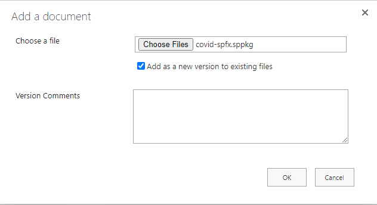
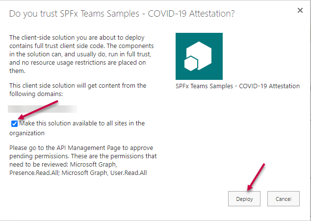
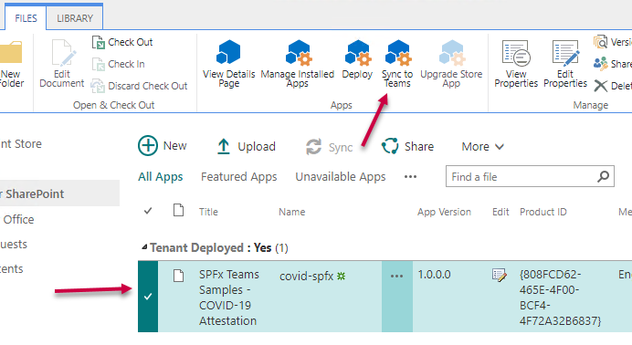

# covid-spfx

## Summary

Short summary on functionality and used technologies.

TODO: PICTURE
[picture of the solution in action, if possible]

## Used SharePoint Framework Version


## Applies to

- [SharePoint Framework](https://aka.ms/spfx)
- [Microsoft 365 tenant](https://docs.microsoft.com/en-us/sharepoint/dev/spfx/set-up-your-developer-tenant)

> Get your own free development tenant by subscribing to [Microsoft 365 developer program](http://aka.ms/o365devprogram)

## Prerequisites

> Any special pre-requisites?

## Solution

Solution|Author(s)
--------|---------
folder name | Author details (name, company, twitter alias with link)

## Version history

Version|Date|Comments
-------|----|--------
1.0|January 29, 2021|Initial release

## Disclaimer

**THIS CODE IS PROVIDED *AS IS* WITHOUT WARRANTY OF ANY KIND, EITHER EXPRESS OR IMPLIED, INCLUDING ANY IMPLIED WARRANTIES OF FITNESS FOR A PARTICULAR PURPOSE, MERCHANTABILITY, OR NON-INFRINGEMENT.**

---

## Minimal Path to Awesome

### Deploy Default Build

A default solution (sppkg) file for this sample exists in the [deployment](./deployment) folder. This sppkg will need to be deployed in the tenants site collection app catalog with the `Make this solution available to all sites in teh organization` option selected. By doing so the solution will be available in every site collection in the tenant, however since the solution has not been enabled for SharePoint deployment it will not be seen anywhere in the UX. Instead, the Teams manifest that is included in the package will be deployed which creates a Personal App that can then be pinned to the left rail in Teams and, if desired, audience targeted to specific user groups using the [Manage app setup policies in Microsoft Teams](https://docs.microsoft.com/en-us/MicrosoftTeams/teams-app-setup-policies).

When complete the solution will actually be running in the root site collection and so the four custom lists that are created and permissions for the various features of the solution will come from the configuration of that root site collection. If you wish to have a specific, custom site collection, host the solution you can still use this sppkg file but you will need to skip step 4 below that sync's the packaged manifest to teams. Instead, you will need to review the [Custom Manifest](./Custom_Manifest) documentation to create an load an alternative manifest.

For even more details about alternate deployment options please review [Custom Build](./covid-spfx/README.md#Custom_Build) documentation for details.

Steps for deployment:

1. Download the SPPKG file, navigate to the [covid-spfx.sppkg](./deployment/covid-spfx.sppkg) file in the [deployment](./deployment) folder of this repository. Select `Download` to save the file to your computer.
1. Upload the sppkg file into the tenant's app catalog by selecting upload, finding the file, and then selecting `OK`.

    

1. A dialog will be displayed asking if you trust the solution. **Make sure you check the `Make this solution available to all sites in teh organization`** check box and then select `Deploy`.

    

1. After the solution has deployed you will need to sync the solution into your Teams app store. To do so, select the solution in the app catalog and then under the files tab in the ribbon the `Sync to Teams` option will be enabled, select it.

    

1. Assuming you received no errors while the solution during the Teams sync, you should now be able to add it into your Teams App Bar as a personal tab. You may want to consider adding the app as a custom pinned site baed on the Teams setup policies, you can learn more about doing so by visiting [Manage app setup policies in Microsoft Teams](https://docs.microsoft.com/en-us/MicrosoftTeams/teams-app-setup-policies). Further, for more information on changing the permissions on who has access to the app, you can read more [View app permissions and grant admin consent in the Microsoft Teams admin center](https://docs.microsoft.com/en-us/microsoftteams/app-permissions-admin-center).

### Custom Manifest

The one drawback of a pre-packaged solution is the inability to target a specific site collection dynamically, ergo the solution deploys, by default, to the root site collection. If you would like to make a communication site specifically for hosing this solution (i.e. the location where custom data is stored) then you can do so by downloading a copy of the manifest.json as well as the two image files from the Teams folder in the source code. With small adjustments you can then target the personal app to a particular site collection you've already created and then upload the Teams app package to customize the location vs deploying the manifest bundled into the sppkg file.

1. Download the two image files for the app in the teams folder by navigate to [/covid-spfx/teams](./covid-spfx/teams). Click on each image file and select `Download` to save the file to your computer.
1. Create a file named `manfiest.json` using a text editor like [VSCode](https://code.visualstudio.com/Download) in the same folder where you downloaded the images in step 1. 
1. Navigate to the manifest.json file in the teams folder and select `Raw` and then copy the contents of the screen and paste it into the manfiest.json file.
1. Modify the /staticTabs/contentUrl value to point to your specific site collection url by adding the relative path to the site collection in the `dest` query string parameter of the url. The updated value below shows the site collection url to be /sites/covid/
    original value:

    ```json
    "contentUrl": "https://{teamSiteDomain}/_layouts/15/TeamsLogon.aspx?SPFX=true&dest=/_layouts/15/teamshostedapp.aspx%3Fteams%26personal%26componentId=3ab8fb75-8f80-4ff1-90a3-6f711ad27c1d%26forceLocale={locale}",
    ```

    updated value:

    ```json
    "contentUrl": "https://{teamSiteDomain}/_layouts/15/TeamsLogon.aspx?SPFX=true&dest=/sites/covid/_layouts/15/teamshostedapp.aspx%3Fteams%26personal%26componentId=141d4ab7-b6ca-4bf4-ac59-25b7bf93642d%26forceLocale={locale}",
    ```

1. Zip the two image files plus the manifest.json file, and upload the package into your Teams Admin center, for detail about this process please refer to [Publish a custom app by uploading an app package](https://docs.microsoft.com/en-us/microsoftteams/upload-custom-apps).

## Features

Description of the extension that expands upon high-level summary above.

This extension illustrates the following concepts:

- topic 1
- topic 2
- topic 3

> Notice that better pictures and documentation will increase the sample usage and the value you are providing for others. Thanks for your submissions advance.

> Share your web part with others through Microsoft 365 Patterns and Practices program to get visibility and exposure. More details on the community, open-source projects and other activities from http://aka.ms/m365pnp.

## References

- [Getting started with SharePoint Framework](https://docs.microsoft.com/en-us/sharepoint/dev/spfx/set-up-your-developer-tenant)
- [Building for Microsoft teams](https://docs.microsoft.com/en-us/sharepoint/dev/spfx/build-for-teams-overview)
- [Use Microsoft Graph in your solution](https://docs.microsoft.com/en-us/sharepoint/dev/spfx/web-parts/get-started/using-microsoft-graph-apis)
- [Publish SharePoint Framework applications to the Marketplace](https://docs.microsoft.com/en-us/sharepoint/dev/spfx/publish-to-marketplace-overview)
- [Microsoft 365 Patterns and Practices](https://aka.ms/m365pnp) - Guidance, tooling, samples and open-source controls for your Microsoft 365 development
