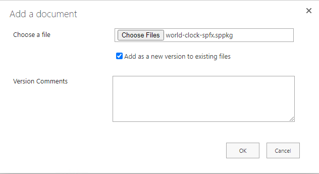
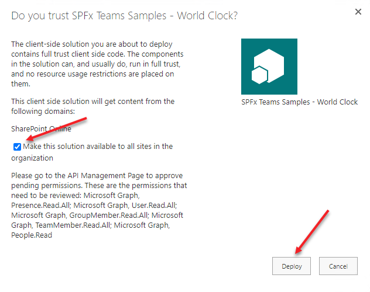
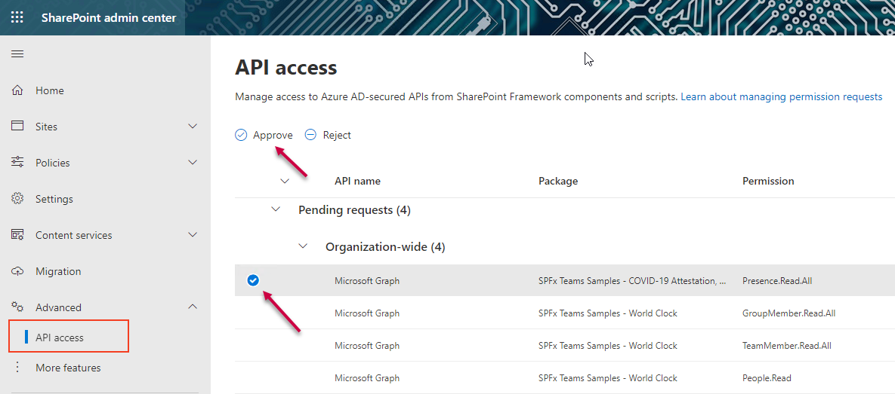
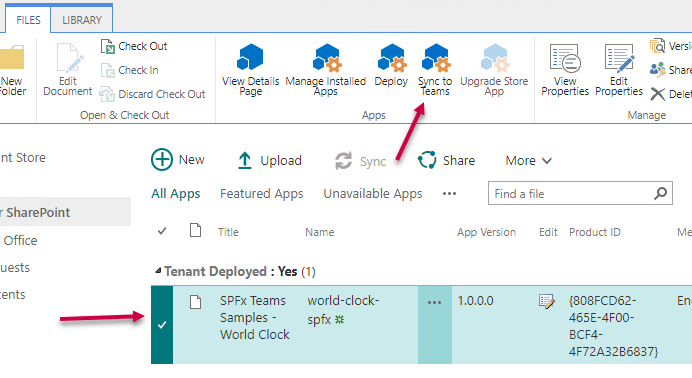

# World Clock Reference Sample

## Summary

The World Clock solution helps teams and managers deal with geographically dispersed team members helping make it easier to reconcile working times and meeting schedules with all the members. The solution can be added as a Teams tab to help members of a Team work together but also as a Personal App to help you manage your personal "teams" who may live in various time zones.

### For Teams

The solution automatically loads each team member into the solution. You can then set your own working schedule, indicating working, possibly working, and not working times. The solution will attempt to determine you IANA timezone when it loads for you, but you can also manage what timezone the solution associates with you to help your co-workers schedule meetings and communicate with you. You can also set the timezone for other team members, including guests so that you can get the solution up and running faster. They can always adjust the values for themselves when they visit the tab.

Once all team members update their working hours (if they're different from the 9:00 to 5:00 default values) and set their timezones you are ready to start scheduling meetings. By selecting the team members you will see a schedule solution show you the working hour availability for each of the selected teammates. Once you have settled on, and selected the best meeting time, you can click `Schedule Meeting` which deep links into the Microsoft Teams meeting scheduler allowing you to set up any specific meeting settings and a description and schedule the meeting.
>Note: Due to limitations with the Microsoft Teams deep linking feature we are unable to include the guests in the meeting invite through the link, they can be added to the meeting manually once you're in the schedule screen. For convenience the members that couldn't be added will be noted in the description field.

The configurations for the team solution is stored in a file in the Team's SharePoint Site Assets library in a folder called `WorldClockApp`.

### For Personal Teams

The solution when used as a personal app will automatically load, and create a default view of, the top 20 _people_ related to you based on the Microsoft Graph algorithm, see [person resource type](https://docs.microsoft.com/en-us/graph/api/resources/person?view=graph-rest-1.0) for more information. Because the team members are personal to you you will be able to set the working schedule, if different than the default, and the timezone for all the users in your view.

Once all the team members are set up, you can start using the solution in the same manner as the Teams tab version.

The configurations for the personal solution are stored in a file in your personal OneDrive in a folder called `WorldClockApp`.

## Used SharePoint Framework Version

## Applies to

- [SharePoint Framework](https://aka.ms/spfx)
- [Microsoft 365 tenant](https://docs.microsoft.com/en-us/sharepoint/dev/spfx/set-up-your-developer-tenant)

> Get your own free development tenant by subscribing to [Microsoft 365 developer program](http://aka.ms/o365devprogram)

## Prerequisites

> Any special pre-requisites?

## Solution

Solution|Author(s)
--------|---------
folder name | Author details (name, company, twitter alias with link)

## Version history

Version|Date|Comments
-------|----|--------
1.0|January 29, 2021|Initial release

## Known Issue

The Teams Desktop client doesn't recognize `US/Hawaii` as a valid timezone, this does work in the web client. Using `US/Aleutian` will give you the same result (GMT-10).

## Disclaimer

**THIS CODE IS PROVIDED *AS IS* WITHOUT WARRANTY OF ANY KIND, EITHER EXPRESS OR IMPLIED, INCLUDING ANY IMPLIED WARRANTIES OF FITNESS FOR A PARTICULAR PURPOSE, MERCHANTABILITY, OR NON-INFRINGEMENT.**

---

## Minimal Path to Awesome

### Deploy Default Build

A default solution (sppkg) file for this sample exists in the [deployment](./deployment) folder. This sppkg will need to be deployed in the tenants site collection app catalog with the `Make this solution available to all sites in the organization` option selected. By doing so the solution will be available in every site collection in the tenant, however since the solution has not been enabled for SharePoint deployment it will not be seen anywhere in the UX. Instead, the Teams manifest that is included in the package will be deployed which creates a Personal App that can then be pinned to the left rail in Teams and, if desired, audience targeted to specific user groups using the [Manage app setup policies in Microsoft Teams](https://docs.microsoft.com/en-us/MicrosoftTeams/teams-app-setup-policies). Further, the App is then also available to be added to individual Teams to provide a Team level experience.

Steps for deployment:

1. Download the SPPKG file, navigate to the [world-clock-spfx.sppkg](./deployment/world-clock-spfx.sppkg) file in the [deployment](./deployment) folder of this repository. Select `Download` to save the file to your computer.
1. Upload the sppkg file into the tenant's app catalog by selecting upload, finding the file, and then selecting `OK`.

    

1. A dialog will be displayed asking if you trust the solution. **Make sure you check the `Make this solution available to all sites in the organization`** check box and then select `Deploy`.

    

1. After the solution has deployed you will need to authorize the Graph API permissions requested. To see, and approve, them navigate to the SharePoint Admin Center and then to the `API access` section under `Advanced` menu item. This will show you a list of pending permissions requests. By selecting each request and then selecting `Approve` the permissions will be granted to allow the solution to access the information it needs through the Microsoft Graph. For more information on the individual permissions this solution is requesting please see the [Microsoft Graph REST API v1.0 reference](https://docs.microsoft.com/en-us/graph/api/overview?toc=.%2Fref%2Ftoc.json&view=graph-rest-1.0)

    

1. After the solution has deployed you will need to sync the solution into your Teams app store. To do so, select the solution in the app catalog and then under the files tab in the ribbon the `Sync to Teams` option will be enabled, select it.

    

1. Assuming you received no errors while the solution during the Teams sync, and you've approved the API permissions, you should now be able to add it into your Teams App Bar as a personal tab. You may want to consider adding the app as a custom pinned site based on the Teams setup policies, you can learn more about doing so by visiting [Manage app setup policies in Microsoft Teams](https://docs.microsoft.com/en-us/MicrosoftTeams/teams-app-setup-policies). Further, for more information on changing the permissions on who has access to the app, you can read more [View app permissions and grant admin consent in the Microsoft Teams admin center](https://docs.microsoft.com/en-us/microsoftteams/app-permissions-admin-center).

1. (Optional) You may also want to add the App to one or more Teams as a new tab in a channel. To do so, navigate to the Team and Channel you want to add the App to. Select the (+) to add a new tab and search for `World Clock`. Once you have added the App as a tab it will load all the team members into the configuration allowing you to use the solution.

    

    

    

    

## References

- [Getting started with SharePoint Framework](https://docs.microsoft.com/en-us/sharepoint/dev/spfx/set-up-your-developer-tenant)
- [Building for Microsoft teams](https://docs.microsoft.com/en-us/sharepoint/dev/spfx/build-for-teams-overview)
- [Use Microsoft Graph in your solution](https://docs.microsoft.com/en-us/sharepoint/dev/spfx/web-parts/get-started/using-microsoft-graph-apis)
- [Publish SharePoint Framework applications to the Marketplace](https://docs.microsoft.com/en-us/sharepoint/dev/spfx/publish-to-marketplace-overview)
- [Microsoft 365 Patterns and Practices](https://aka.ms/m365pnp) - Guidance, tooling, samples and open-source controls for your Microsoft 365 development
